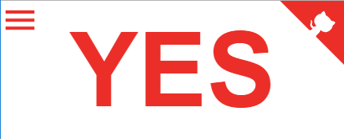
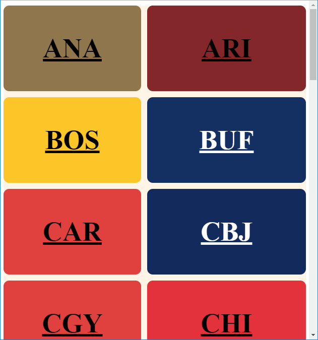
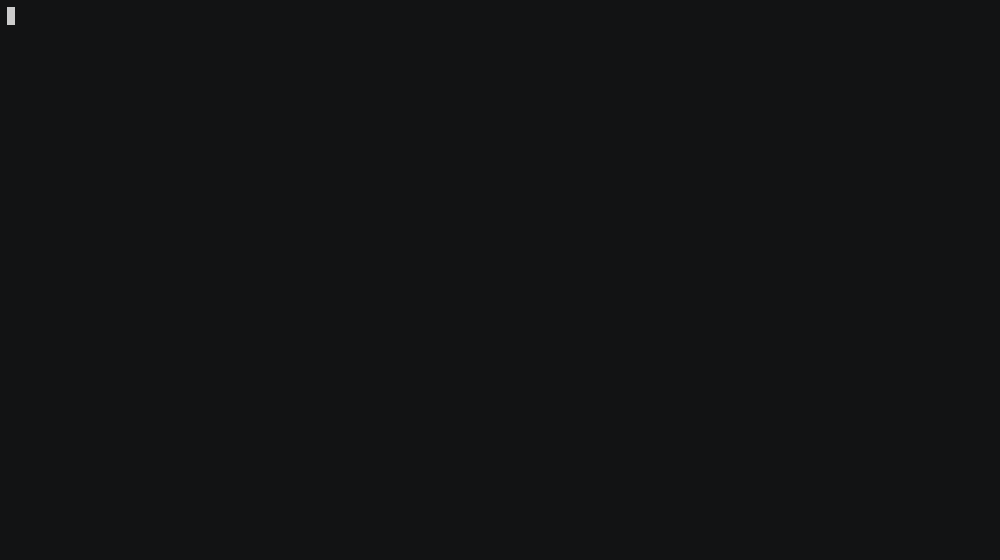

wasthereannhlgameyesterday?
==========================

**W**as**T**here**A**n**N**hl**G**ame**Y**esterday?

Print YES or NO!

Usage
=====

|endpoint | function | format | example | admin |
|----------|--------|-------|---------------|-------------|
|/$TEAM| YES/NO | HTML* | <a href="https://wtangy.se/RedWings">RedWings</a> | |
|/$CITYTEAM| YES/NO | HTML* |<a href="https://wtangy.se/DetroitRedWings">DetroitRedWings</a> | |
|/$CITY| YES/NO |HTML* | <a href="https://wtangy.se/Detroit">Detroit</a> | |
|/$SHORT| YES/NO |HTML* | <a href="https://wtangy.se/DET">DET</a> | |
|/$DATE/$TEAM | YES/NO | HTML*| <a href="https://wtangy.se/20171022/RedWings">20171022/RedWings</a>| |
|/$TEAM/$DATE | YES/NO | HTML*| <a href="https://wtangy.se/RedWings/20171111">RedWings/20171111</a>| |
|/get_schedule | Print Schedule| JSON | | |
|/version | Print Schedule Update Time| JSON/ISODATE | { "<a href="https://wtangy.se/version">version</a>": "2018-01-27T08:57:00.372800" } | |
|/menu | Present user with a clickable menu | HTML | <a href="https://wtangy.se/menu">menu</a> | |
|/update_schedule | Update Schedule | | 202 on changed | Y |

\*  If you use Curl, Wget or Python-Urllib then all you get is YES or NO

Examples
----------

case insensitive:  

 * https://wtangy.se
 * https://wtangy.se/det
 * https://wtangy.se/redwings
 * https://wtangy.se/nyrangers
 * https://wtangy.se/Vgk
 * https://wtangy.se/newyorkrangers
 * https://wtangy.se/20171222
 * https://wtangy.se/22-12-2017
 * https://wtangy.se/22-12-2017/DET
 * https://wtangy.se/lak/20171014
 * https://wtangy.se/foo/20171014
 * https://wtangy.se/foo/20170901

What do these mean?

 * *Not choosing anything just tells you if there was a game yesterday*
 * *Choosing a team means you only get YES if that team played yesterday.*
 * *Choosing a date means you only get YES if there is a game on _that_ date.*
 * *Choosing a team and a date you only get YES if the chosen team plays/played on that date.*
 * *Choosing a team incorrectly and a date correctly you only get YES if there was/is a game on that date*

There's also:

 * https://wtangy.se/menu # select a team
 * https://wtangy.se/get_schedule # get the schedule this website uses in JSON
 * https://wtangy.se/update_schedule # for admins only
 * https://wtangy.se/version # tells when the backend schedule was last updated

Features
========

 * Persistent team selection using HTML5 Web Storage. If you choose a team in the menu and you later revisit https://wtangy.se (from the same browser) you'll see the result for that team.
 * This works with the new NHL.com website (2017-)

Why?
====

So I(author) live in a timezone where the NHL games are often over at 5am in the morning, sometimes they start then. I tend to watch replays. I'm not always sure if there was a game yesterday. Schedules online often have the results, news or "yes, also it went to overtime" to spoil the game.

It would be really nice if I could just browse to $URL/team and it would tell me if my team played yesterday or during Stanley Cup (or regular season) $URL would be enough to just tell me if there was a game at all.

Now there is! :)

How to update the schedule inside the scripts?
====

The schedule used by this web site is stored in the backend.

As an admin you can update it manually or configure a <a href="gcloud.md">cronjob</a>. It will send an e-mail with schedule changes outside playoffs.

What about regular season and playoffs?
==================================================

It also worked for 2020-21 playoffs :)

Currently the script doesn't differentiate between playoffs and regular seasons.

It just takes the dates from NHL.com's <a href="https://statsapi.web.nhl.com/api/v1/schedule?startDate=2017-10-04&endDate=2017-10-22">API</a>. There are more arguments to this API that I have not found any official documentation for. There is however This great resource: https://gitlab.com/dword4/nhlapi

 Here's one result from google searches:
<pre>
https://statsapi.web.nhl.com/api/v1/schedule/startDate=2016-01-31&endDate=2016-02-05?expand=schedule.teams,schedule.linescore,schedule.broadcasts,schedule.ticket,schedule.game.content.media.epg&leaderCategories=&site=en_nhl&teamId=&
</pre>

TODO / Known issues
====================

 * Add notifications with whole schedule, maybe instead uploading the diff to GCS and send a link?
 * Choosing background color - would be sweet if it could do HTML5 so users can choose themselves too like in https://www.w3schools.com/colors/colors_picker.asp
 * games include preseason - if this is a problem let me know!
 * add a calendar selection too near the menu?
 * dynamically generate a sitemap.xml
 * Réal Names of cities:
   * querying St. Louis Blues (so with the .) is currently working. Without the dot and spaces does not work.
   * also entering teams or cities with spaces does not work, like <a href="/New York Islanders">New York Islanders</a>
 * improve testing
   * update schedule_testing and then verify it / validate json
   * performance testing
   * lint javascript,css,html
   * lint python <a href="https://github.com/martbhell/wasthereannhlgamelastnight/issues/16">#16</a>
 * Use <a href="https://cloud.google.com/security-key-management">Google KMS</a> For Encrypting Secrets </a>
   * Twitter Keys are stored in a private bucket

Source
======

<a href="gcloud.md">gcloud</a> - reminders for myself.

Forked from https://github.com/amanjeev/isitfridaythe13th because it had the google appspot already in it and python :) Thanks! In 2022 this fork was extracted/detached because the upstream Friday 13 had been archived and because one couldn't change pull requests to by default target the wtangy repo.

wasthereannhlgamelastnight(..) has been re-written a few times - it's no longer even close to the isitfridaythe13th, for example:
 - it now uses webapp2 for example instead of python print to stdout.
 - it used to have a manual NHL_schedule.py with a set and a list, now it reads and writes to gcloud object store!
 - used to be python2 and webapp2 on GAE, in 2022 it's python3 and Flask on GAE! 
